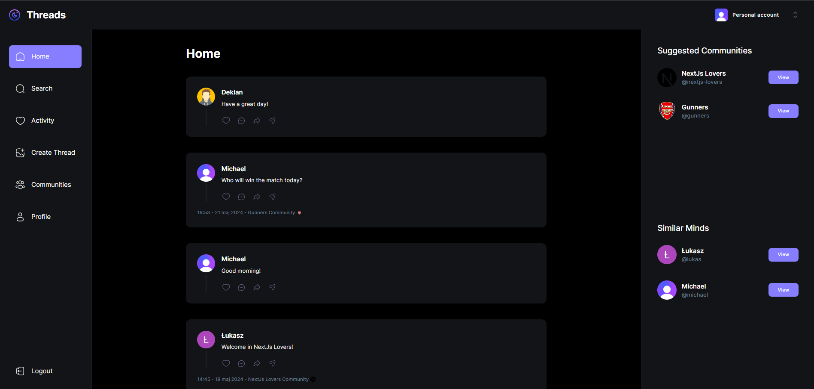

# Threads

Threads is a social media application designed to enable users to share posts, follow other users, and engage with content. This project is based on a video guide by [JavaScript Mastery](https://www.youtube.com/channel/UCmXmlB4-HJytD7wek0Uo97A). The tutorial video can be found [here](https://www.youtube.com/watch?v=O5cmLDVTgAs&ab_channel=JavaScriptMastery).


## Tech Stack
- Next.js
- MongoDB
- Shadcn UI
- TailwindCSS
- Clerk
- Webhooks
- Serverless APIs
- React Hook Form
- Zod
- TypeScript

## Features

- **User Authentication:** Secure user login and registration.
- **Post Creation:** Users can create and share posts with text and images.
- **Commenting Feature: :** A commenting feature to facilitate discussions within threads.
- **User Profiles:** View and edit user profiles.
- **Comunnities** Allow users to create new communities and invite others using customizable template emails.
- **Responsive Design:** The application is fully responsive and works seamlessly on all devices.


## Demo

Check out the live deployment of Evently [here](https://threads-sage-theta.vercel.app/).

## Screenshots

### Home Page



## Installation

To get a local copy up and running, follow these simple steps.

### Installation Steps

1. **Clone the repository:**
   ```sh
   git clone https://github.com/Cheest98/Threads

2. **Navigate to the project directory:**
   ```sh
   cd evently

3. **Install dependencies:**
   ```sh
   npm install
   
4. **Set up environment variables:**
 - Create a .env file in the root directory.
 - Add the following variables to the `.env` file
   ```sh
   MONGODB_URL=
   CLERK_SECRET_KEY=
   UPLOADTHING_SECRET=
   UPLOADTHING_APP_ID=
   NEXT_CLERK_WEBHOOK_SECRET=
   NEXT_PUBLIC_CLERK_PUBLISHABLE_KEY=

5. **Run the application:**
   ```sh
   npm start
   
### Usage

1. Open your browser and go to http://localhost:3000.
2. Register or log in to your account.
3. Create, manage, and join events with ease.

